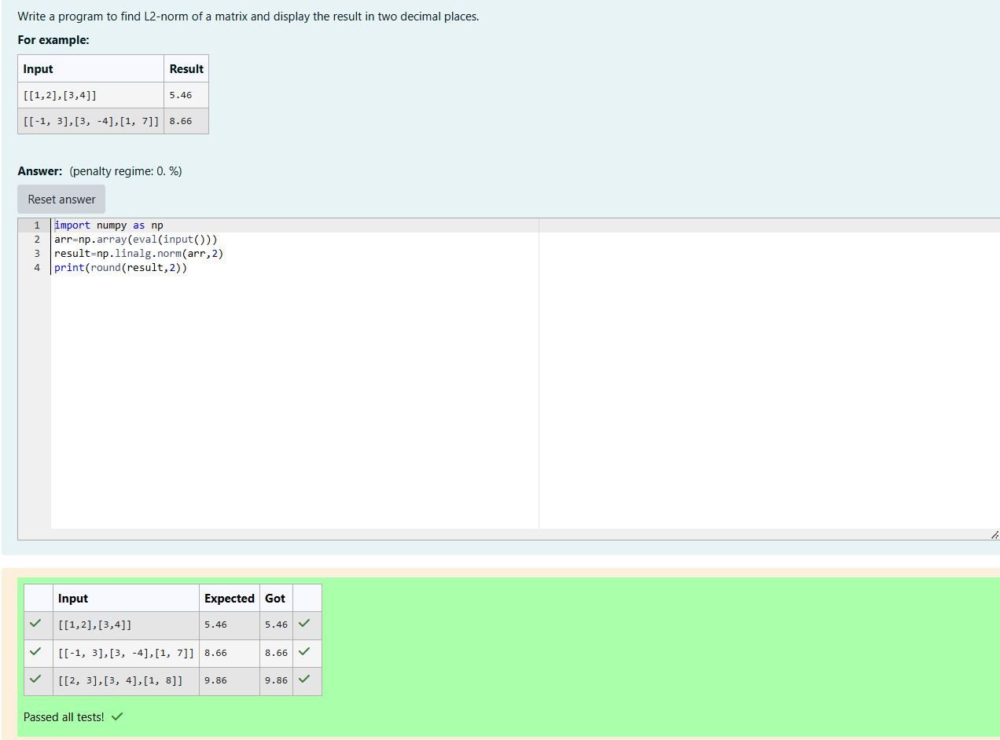
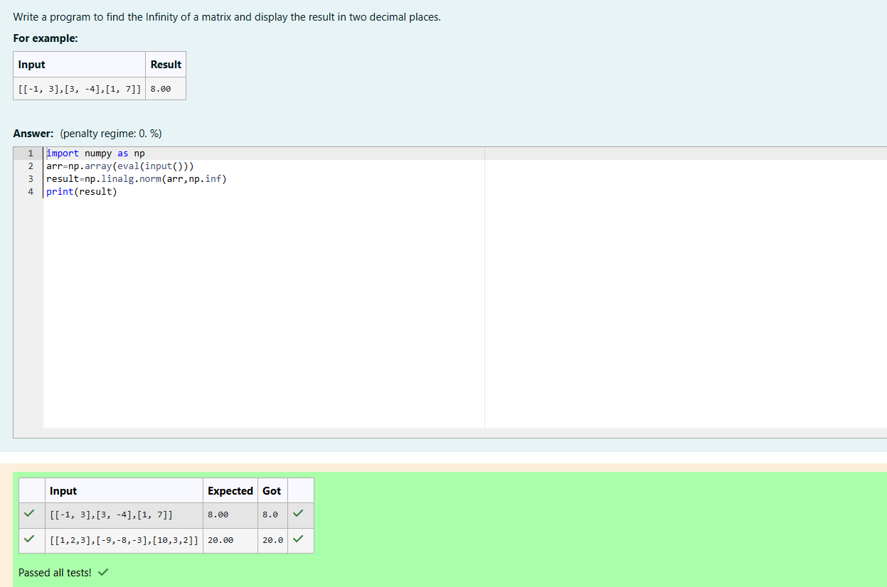

# Norm of a matrix
## Aim
To write a program to find the 1-norm, 2-norm and infinity norm of the matrix and display the result in two decimal places.
## Equipment’s required:
1.	Hardware – PCs
2.	Anaconda – Python 3.7 Installation / Moodle-Code Runner
## Algorithm:1
	1. Step1: Get the input matrix using np.array()   
    
	2. Step2: Find the 1-norm of the matrix using np.linalg.norm()
	
	3. Step3: Print the norm of the matrix.

## Algorithm:2
    1. Step1: Get the input from the user np.array()

	2. Step2:Find the 2-norm of the matrix

	3. Step3: Print the norm of the matrix in two decimal point


## Algorithm:3
    1. Step1: Get the input from the user np.array()

	2. Step2:Find the infinite-norm of the matrix

	3. Step3: Print the norm of the matrix.
## Program:
```
# Register No: 24900817
# Developed By: selvaganesh.B
# 1-Norm of a Matrix

import numpy as np
arr=np.array(eval(input()))
result=np.linalg.norm(arr,1)
print(result)


# 2-Norm of a Matrix

import numpy as np
arr=np.array(eval(input()))
result=np.linalg.norm(arr,2)
print(round(result,2))


# Infinity Norm of a Matrix


import numpy as np
arr=np.array(eval(input()))
result=np.linalg.norm(arr,np.inf)
print(result)


```
## Output:
### 1-Norm of a Matrix


### 2-Norm of a Matrix


### Infinity Norm of a Matrix


## Result
Thus the program for 1-norm, 2-norm and Infinity norm of a matrix are written and verified.
